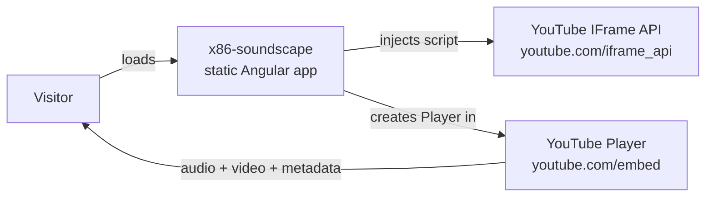
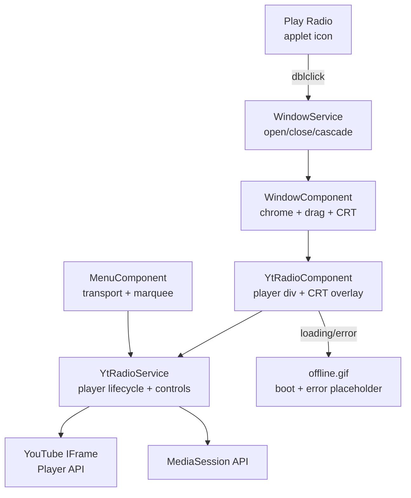
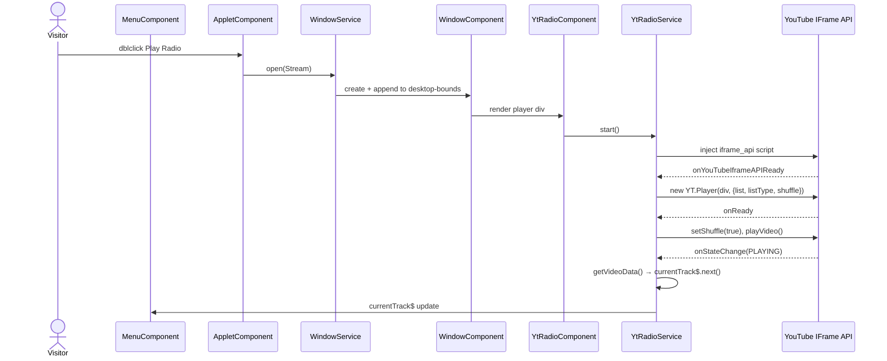

## Context

The Play Radio applet (`AppletTypes.Stream`) currently drives `WinampService.playRadio()`, which sets Webamp's playlist to every entry in `Songs.songs` and begins playback. Live radio streams (ICY/Icecast/AzuraCast) are the audio source. The menubar transport and Now Playing marquee are wired through `WinampService` and `MetadataService`.

YouTube is the intended source for a new radio-style station, but every server-side and proxy path to YouTube audio is blocked (verified empirically, July 2026). The only unblockable path is YouTube's own IFrame Player API, which resolves playlists from the visitor's IP and plays them inside an embed controlled by YouTube's runtime.

The site already hosts embedded iframes inside draggable CRT-styled windows: the WeatherStar applet (`WeatherComponent` + `CrtComponent`) renders a `weatherstar.netbymatt.com` or `weather.com/retro/` iframe inside window chrome. The new radio follows this pattern.

In-force ADR context: 001 (Webamp inside `desktop-bounds` — windows belong there), 002 (data-driven per-track metadata pipeline — menubar/MediaSession fed from one source of truth), 003 (client-side direct fetch of CORS-enabled sources — zero-backend philosophy), 004 (container-relative window cascade), 005 (responsive menubar), 006 (weather source registry pattern).

## Goals / Non-Goals

**Goals:**

- Play a configured YouTube playlist from the site with zero servers, no hosted files, no API keys
- Each visitor gets a unique shuffled session; playlist edits go live on page load
- The experience appears as a CRT-window applet alongside WeatherStar, not inside Webamp
- Menubar transport and Now Playing display are rewired to the radio player
- Unplayable videos are skipped; repeated failures surface an offline state

**Non-Goals:**

- Shared-broadcast sync between listeners (eliminated early in design)
- Playing YouTube audio inside Webamp (bytes are inaccessible to JavaScript)
- Removing or replacing Webamp — it stays as-is for its own station list
- Any external hosting dependency (bucket, proxy instance, Cloudflare Worker)
- Downloading/storing audio client-side

## Decisions

### D1: YouTube IFrame Player API as the audio engine

The IFrame Player API (`youtube.com/iframe_api`) is the sanctioned embed. It loads the playlist from the visitor's own IP, handles all playback, and auto-advances through shuffled entries. No byte access is needed, no CORS issue exists, and no bot-blocking can target it.

*Why not alternatives:* Every byte-fetching path (yt-dlp, Piped, Invidious, cobalt) is blocked at the YouTube boundary. A browser extension would work but requires installation. An IFrame embed satisfies every stated constraint.

*Trade-off:* The video is visible inside the window. YouTube's embed ToS require visible playback (minimum 200×200). A small 4:3 frame styled as a CRT satisfies this and fits the site's retro aesthetic.

### D2: `YtRadioService` owns the player lifecycle

A new Angular service (`services/yt-radio/yt-radio.service.ts`) handles script injection, player creation, event dispatch, and control delegation. It exposes `currentTrack$` with the same `{artist, title}` shape as `MetadataService` and sets MediaSession metadata on state changes.

*Why not reuse MetadataService:* MetadataService is tied to `TrackWithMeta` and `metadataParser.kind` from `songs.ts`. The IFrame player needs none of that — its metadata comes from `player.getVideoData()` on every state change. A separate service with the same output shape is simpler than forcing the IFrame into the existing pipeline.

*Why not a component-level service:* The menubar component needs to reach the player controls. A shared injectable service (providedIn: 'root') is the standard Angular pattern for this in the codebase.

### D3: Window via `WindowService` mirroring the WeatherStar pattern

The radio window appears via `WindowService.open({selector: AppletTypes.Stream})`, same mechanism that opens WeatherStar and Announcements. The `window.component.html` gets a new `*ngSwitchCase` hosting `<app-yt-radio>` inside window chrome with `
` wrapping the player.

*Why not a standalone popup:* Every draggable window in the site goes through `WindowService`. Breaking that pattern would create a second window-management surface.

### D4: Menubar rewires entirely to `YtRadioService`

The five transport methods and Now Playing subscription in `menu.component.ts` switch from `WinampService`/`MetadataService` to `YtRadioService`. `WinampService` loses its dead transport methods. Webamp's own in-window controls remain functional through the Webamp applet icon.

*Why full rewire, not dual source:* Two sources competing for the same menu display and MediaSession creates last-writer-wins ambiguity. One active source per UI surface is cleaner. The Webamp applet has its own controls and its own icon on the desktop.

### D5: Error handling with consecutive-failure guard

`onError` events (deleted video, embedding disabled, private) call `nextVideo()`. After 5 consecutive errors, the service enters an offline state: `currentTrack$` emits a station-offline descriptor, and the component shows `offline.gif` (same asset the weather window uses during loading). The guard resets on any successful playback.

*Why not a one-strike offline:* Individual videos break all the time; skipping is expected. The offline state signals "the entire playlist is gone or private," which requires a different user expectation than a single dead video.

### D6: Hand-rolled `YT` types instead of `@types/youtube`

Minimal type declarations for the IFrame API (`yt.d.ts`) follow the existing `icecast-metadata-stats.d.ts` precedent — no new npm dependency, no dependency on a third-party types package that may lag behind the API.

## C4 Diagrams

*Assumptions: Mermaid format (renders on GitHub), lightweight C4-inspired (context + component, no deployment diagram — the site deploys statically already).*

### System Context

### Component: Radio Window

### Sequence: Play Radio launch

## Risks / Trade-offs

**YouTube IFrame API reliability** — If YouTube's embed API changes or the playlist ID becomes invalid, the station fails silently. *Mitigation:* the 5-strike offline guard surfaces the state; the component shows the existing `offline.gif` placeholder; the playlist ID is a one-line constant, easy to update.

**Autoplay policy** — Browser may block `playVideo()` if the async ready callback escapes the user-gesture window. *Mitigation:* the YouTube player itself renders a large play button when paused; the user clicks once to start. The window-open gesture is the best we can do without a user-initiated play button inside the component.

**MediaSession race** — If the Webamp applet is also playing, both `YtRadioService` and `MetadataService` write to `navigator.mediaSession`. *Mitigation:* last-writer-wins is the existing behavior (station streams already race today); in practice the user only plays one source at a time. No action needed for v1.

**Video visible in the player** — YouTube requires visible playback. *Mitigation:* the CRT-styled 4:3 frame fits the site's retro aesthetic naturally. The window can be dragged aside or closed when the user wants it out of view.

## Migration Plan

No migration needed. The change is additive (new window, new service) except for the menubar rewiring and `WinampService` method deletions. Rollback is `git revert` — no data, no storage, no external state.

## Open Questions

None. All design decisions are settled by the tradeoff dialogue and live probing that preceded this change.
